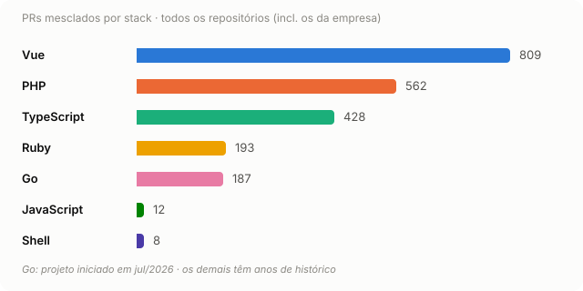

# Rodolfo Santos

**Engineering Manager & full-stack dev** · Go · TypeScript · Vue · PHP · Ruby

 

<picture>
  <source media="(prefers-color-scheme: dark)" srcset="assets/languages-chart-dark.svg">
  
</picture>

Ver como tabela

| Stack | PRs | Observação |
|---|---|---|
| Vue | 809 | desde 2021 |
| PHP | 562 | Laravel |
| TypeScript | 428 | |
| Ruby | 193 | Rails |
| Go | 187 | projeto iniciado em jul/2026 |
| JavaScript | 12 | |
| Shell | 8 | |

 

Lidero o time de engenharia de Pagamentos na <strong>Quero Educação</strong>.

 

<picture>
  <source media="(prefers-color-scheme: dark)" srcset="https://github-readme-streak-stats.herokuapp.com/?user=rodolfo-santos&hide_border=true&theme=dark">
  
</picture>

